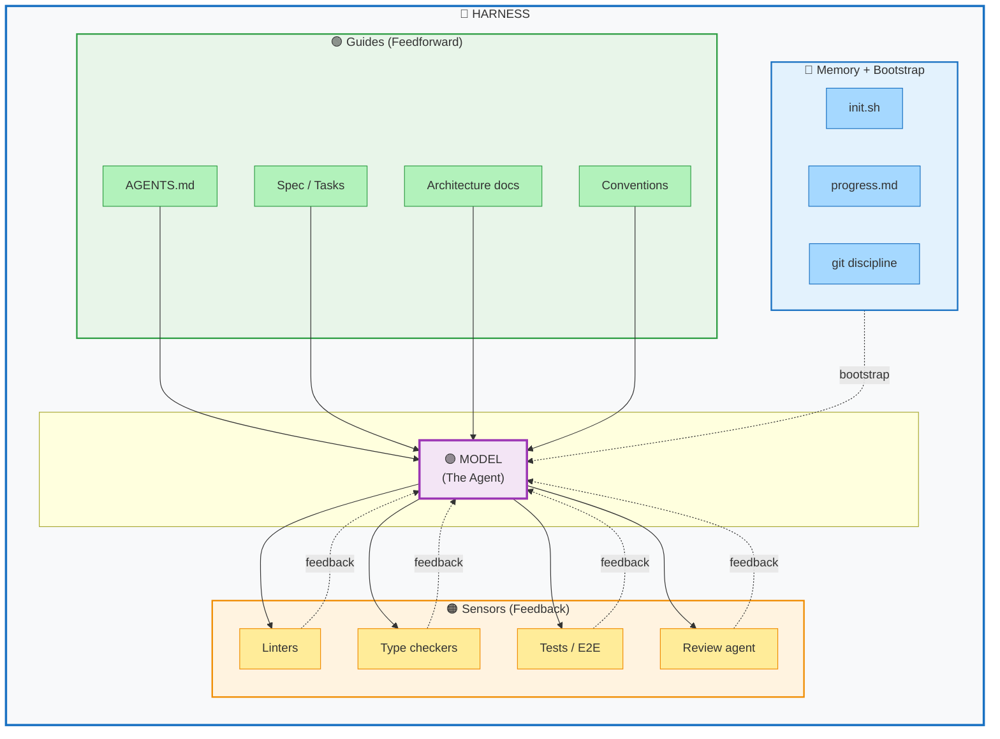

# Agent Harness Architecture

## What is a Harness in Agentic Engineering?

In agentic engineering, a **harness** is a structured framework that surrounds and supports an AI agent (or model) to ensure reliable, consistent, and high-quality performance. Much like a test harness in software engineering or a racing harness in motorsports, an agent harness provides:

- **Guidance & Constraints**: Directs the agent toward desired behaviors through specifications, conventions, and documentation
- **Feedback Loops**: Continuously monitors outputs and provides corrective feedback
- **Memory & Context**: Maintains state, progress tracking, and bootstrapping information
- **Quality Assurance**: Enforces standards through automated checks and reviews

The harness acts as the bridge between the raw capabilities of a foundation model and the specific requirements of a production system.

---

## Harness Architecture Diagram

---

## Component Breakdown

### 🟢 Guides (Feedforward)
These are proactive instructions and context provided to the model **before** it acts:

| Component | Purpose |
|-----------|---------|
| **AGENTS.md** | Defines agent personas, capabilities, and behavioral guidelines |
| **Spec / Tasks** | Requirements documents and task specifications |
| **Architecture docs** | System design, patterns, and technical constraints |
| **Conventions** | Coding standards, naming conventions, style guides |

### 🟣 Model (The Agent)
The central AI model that performs reasoning and generation tasks. The harness exists to make this component more effective and reliable.

### 🔵 Memory + Bootstrap
State management and initialization components:

| Component | Purpose |
|-----------|---------|
| **init.sh** | Setup scripts, environment configuration, dependency installation |
| **progress.md** | Tracks completed tasks, current state, and next steps |
| **git discipline** | Version control practices, commit conventions, branch management |

### 🟠 Sensors (Feedback)
Reactive components that validate outputs and provide corrective feedback:

| Component | Purpose |
|-----------|---------|
| **Linters** | Static analysis for code style and potential errors |
| **Type checkers** | Validates type correctness and interface contracts |
| **Tests / E2E** | Automated test suites including unit, integration, and end-to-end tests |
| **Review agent** | Secondary AI agent that reviews outputs for quality and compliance |

---

## How the Harness Works

### 1. **Feedforward Flow** (Green → Purple)
Before the model generates output, it receives:
- Context from `AGENTS.md` about its role
- Requirements from `Spec / Tasks`
- Design constraints from `Architecture docs`
- Style guidance from `Conventions`

### 2. **Bootstrap Flow** (Blue)
The environment is prepared through:
- `init.sh` sets up the workspace
- `progress.md` provides continuity from previous sessions
- `git discipline` ensures version control hygiene

### 3. **Feedback Flow** (Orange → Purple)
After generation, outputs are validated by:
- **Linters** catch style violations
- **Type checkers** catch type errors
- **Tests** catch functional regressions
- **Review agent** catches logical errors and omissions

Errors flow back to the model for correction, creating a closed-loop system.

---

## Benefits of the Harness Pattern

| Benefit | Description |
|---------|-------------|
| **Consistency** | Ensures outputs follow established patterns and standards |
| **Reliability** | Catches errors before they propagate to production |
| **Scalability** | New agents can be onboarded using the same harness structure |
| **Observability** | Progress tracking and git history provide audit trails |
| **Iterative Improvement** | Feedback loops enable continuous refinement |

---

## Implementation Tips

1. **Start with AGENTS.md** - Define your agent's persona and capabilities first
2. **Invest in bootstrap scripts** - A robust `init.sh` saves time on every session
3. **Layer your sensors** - Run fast checks (linters) before slow checks (E2E tests)
4. **Keep progress.md updated** - This is your agent's "working memory" across sessions
5. **Automate the harness** - The best harnesses run automatically without manual intervention