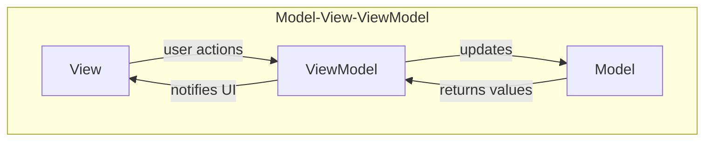

the main difference between mvvm and mvp is that the presenter has a 
reference to the view whereas the ViewModel doesn't have that instead,
a view directly binds to properties on the viewmodel to send and receive
updates.