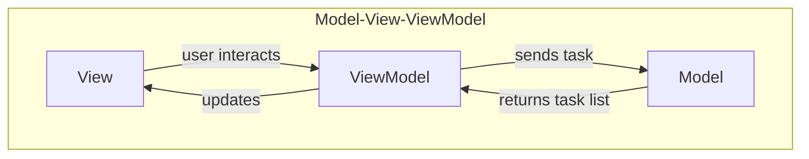

```mermaid
graph TD
    A[View] -->|user interacts| B[ViewModel]
    B -->|sends task| C[Model]
    C -->|returns task list| B
    B -->|updates| A

    subgraph Model-View-ViewModel
        C
        B
        A
    end

```
