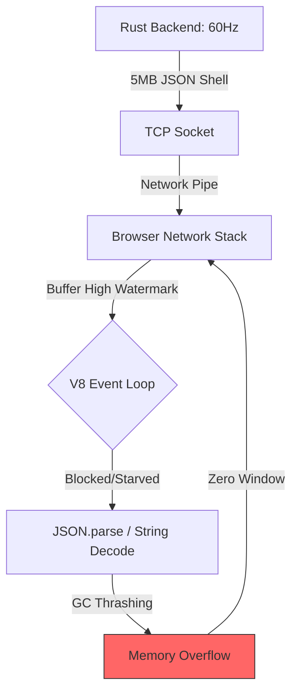

# 📊 Performance Analysis: JSON vs. FlatBuffers at Scale

This report summarizes the observations from the 60Hz sensor telemetry POC, specifically addressing the "Permanent Stall" issue encountered with Native JSON at a matrix size of 50,000 nodes.

## 1. The Bottleneck: Why JSON "Constipates"

At 50,000 sensors, the telemetry stream produces approximately **300MB/s** of raw string data. We observed that while Protobuf and FlatBuffers remained fluid, the JSON panel would "stall" and never recover, even after reducing the sensor count.

### 🧩 The Multi-Layer Failure

1. **Text Transformation Cost**: JSON requires the browser to perform a full UTF-8 string decode and a recursive parse of 50,000 objects every 16ms.
2. **The Memory Death Spiral**: 3 million objects per second causes the JavaScript Garbage Collector (GC) to run 100% of the time, starving the code that actually reads from the network.
3. **TCP Backpressure**: When the browser stops "pulling" data from the socket, the TCP Receive Window shrinks to zero. The connection effectively pauses, but because the buffer is "poisoned" with massive old frames, it cannot resume even when pressure is reduced.

---

## 2. Protocol Architectural Comparison

| Metric | Native JSON | Protobuf | FlatBuffers |
| :--- | :--- | :--- | :--- |
| **Data Format** | Text (UTF-8) | Binary (Varint) | Binary (Zero-Copy) |
| **Payload (50k nodes)** | ~5,200 KB | ~1,050 KB | ~1,200 KB |
| **Client CPU Cost** | High (Full Parse) | Medium (Deserialization) | **Minimal (Direct Access)** |
| **Memory Pressure** | Extreme (GC Thrashing) | Moderate | **None (Pointer-based)** |
| **Scalability** | Crashes at >20k | Stable to 100k+ | **Stable to Hardware Limit** |

---

## 3. Observed Symptoms & Diagnostics

During the test, we implemented a "Watchdog" and "Drop Counter" which revealed the following terminal symptoms:

### 🚨 Symptom: The Stall
* **Observation**: Watchdog logs `STALL DETECTED: No frame for 5s... 7s...`.
* **Explanation**: The browser has entered a **Zero-Window** state. The network "pipe" is clogged with 5MB text frames that the browser can no longer process.

### 📉 Symptom: The Drop Rate
* **Observation**: Console warns `Dropped 500 frames...`.
* **Explanation**: The CPU is so busy parsing Frame #1 that by the time it finishes, Frames #2 through #30 have already arrived. JSON's lack of random access forces it to spend effort on every frame, leading to a cumulative backlog.

---

## 4. Why Binary Formats Win

### The "Book" vs. "Map" Analogy
* **JSON** is like being sent a **5,000-page book** every 16ms and being told you must read the whole thing before you can see any single page.
* **FlatBuffers** is like being sent an **Indexed Map**. You don't "read" the data; you just look at the specific coordinate you want. The browser never has to "parse" the 50k sensors to find Sensor #1; it just jumps to that memory offset instantly.

## 5. Final Conclusion
The experiment confirms that for **Real-Time Telemetry (High-Frequency/High-Volume)**, JSON is not a viable protocol. The failure of JSON at 50k nodes was not a software bug, but a **physical saturation** of the browser's ability to handle raw text serialization. 

Binary protocols (specifically FlatBuffers) are the only way to maintain a responsive 60Hz UI at industrial scales.
